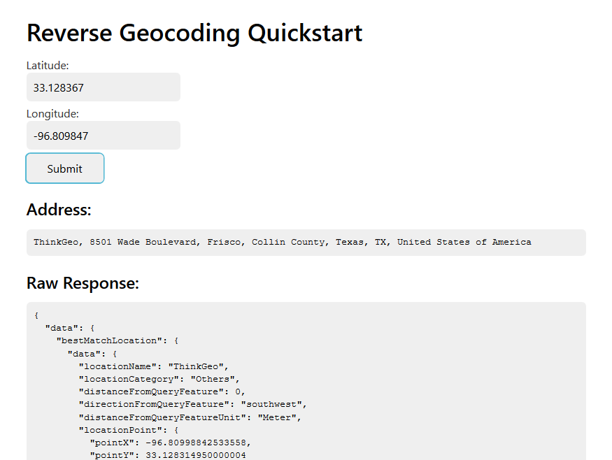

# Cloud Maps

## Repository Layout

`/docs`: An offline version the products documentation.

`/samples`: A collection of feature by feature samples.

`/assets`: Any assets needed for the readme.md.

`README.md`: A quick start guide to show you how to quickly get up and running.

## Available REST API Services

- [Vector Maps](https://docs.thinkgeo.com/products/cloud-maps/v12.0/services/vector-map-tiles/) - vector map tiles through XYZ
- [Raster Maps](https://docs.thinkgeo.com/products/cloud-maps/v12.0/services/raster-map-tiles/) - get raster map tiles through XYZ
- [WMS](https://docs.thinkgeo.com/products/cloud-maps/v12.0/services/wms-maps/) - get map images through a standards-compliant WMS (Web Map Service)
- [Routing](https://docs.thinkgeo.com/products/cloud-maps/v12.0/services/routing/) - get turn-by-turn driving directions, define service areas that can be reached by car in a given time or distance, and more
- [Geocoding](https://docs.thinkgeo.com/products/cloud-maps/v12.0/services/geocoding/) - get location data from an address
- [Reverse Geocoding](https://docs.thinkgeo.com/products/cloud-maps/v12.0/services/reverse-geocoding/) - find an address from a location/location coordinates
- [Elevation](https://docs.thinkgeo.com/products/cloud-maps/v12.0/services/elevation/) - get elevation data by points, lines and polygons using SRTM and NED13 data
- [Map Queries](https://docs.thinkgeo.com/products/cloud-maps/v12.0/services/map-query/) - perform spatial query against several types of data.
- [Projection](https://docs.thinkgeo.com/products/cloud-maps/v12.0/services/projection/) - re-project a point, line, or polygon shape between two coordinate systems
- [Time Zones](https://docs.thinkgeo.com/products/cloud-maps/v12.0/services/time-zones/) - get time zone and UTC offset information for a given spatial coordinate
- [Colors](https://docs.thinkgeo.com/products/cloud-maps/v12.0/services/colors/) - generate harmonious themes of colors, which you can use to design attractive and meaningful maps

## Samples

We have a number of samples for both WPF and Javascript that show off ThinkGeo Cloud Maps' full capabilities. You can use these samples as a starting point for your own application, or simply reference them for how to use our controls using best practices.

- [WPF samples](https://gitlab.com/thinkgeo/public/thinkgeo-cloud-maps/-/tree/master/samples/wpf)
- [Javascript samples](https://gitlab.com/thinkgeo/public/thinkgeo-cloud-maps/-/tree/master/samples/javascript)

---

## Quickstart Guides

- [WPF Quickstart](#quick-start-reverse-geocode-pois-in-wpf)
- [Javascript Quickstart](#quick-start-reverse-geocode-pois-in-javascript)

## Quick Start: Reverse Geocode POIs in WPF

In this sample we will use the Reverse Geocoder Cloud API to find the first point of interest within one mile of a location and display its information.  This will demonstrate a number of features common to the various Cloud APIs such as optional parameters and generally setting up a call.

We will begin by creating a .NET Core Console project in your favorite editor.  Next we will walk you through adding the required packages.  Then we will add some code to show you how to make a call to the Cloud Maps API using our built in C# client classes.  After reading this you will be in a good position to look over our [other samples](https://gitlab.com/thinkgeo/public/thinkgeo-cloud-maps/-/tree/master/samples) and explore our other features.

### Step 1: Setup a New Project

In your editor of choice you need to create a **.NET Core Console** project.  Please see your editor's instructions on how to create the project.  Here is an [example](https://docs.microsoft.com/en-us/dotnet/core/tutorials/with-visual-studio?tabs=csharp) using Visual Studio for reference.

### Step 2: Add NuGet Packages

You will need to install the **ThinkGeo.Core** NuGet package.  We highly suggest you use your editors [built in NuGet package manager](https://docs.microsoft.com/en-us/nuget/quickstart/install-and-use-a-package-in-visual-studio) if possible.  If you're not using an IDE you can [install it via the the dotnet CLI](https://docs.microsoft.com/en-us/nuget/consume-packages/install-use-packages-dotnet-cli) from inside your project folder where where your project file exists.

```shell
dotnet add package ThinkGeo.Core
```

### Step 3: Add Required Namespaces to `Program.cs`

Add the required using.

```csharp
using ThinkGeo.Core;
```

### Step 4: Setup the ReverseGeocoder Client

Add the code below to the `Program.cs`.  Note that you can use your own ClientID and Secret based on your account at our [Cloud Maps Console](https://cloud.thinkgeo.com). All of the cloud clients end in `CloudClient`.

```csharp
// Create the client and set the ClientId and Secret
ReverseGeocodingCloudClient reverseGeocoder = new ReverseGeocodingCloudClient();

reverseGeocoder.ClientId = "FSDgWMuqGhZCmZnbnxh-Yl1HOaDQcQ6mMaZZ1VkQNYw~";
reverseGeocoder.ClientSecret = "IoOZkBJie0K9pz10jTRmrUclX6UYssZBeed401oAfbxb9ufF1WVUvg~~";
```

### Step 5: Define Optional Parameters

Many of our APIs have optional parameters that change the results of the request. In this case we only want to find the first item in the area and we want to have as much data returned as possible for that one location.

```csharp
// Set optional options to return verbose results as well as limit the results to the first one found
CloudReverseGeocodingOptions options = new CloudReverseGeocodingOptions()
{
    ResultDetail = CloudReverseGeocodingResultDetail.Verbose,
    MaxResults = 1
};
```

### Step 6: Execute the Call Synchronously

We are now calling the method passing in the search location along with the search distance, search distance unit and the optional parameters we defined above.  This call is being made synchronously however there there are asynchronous methods available as well.

```csharp
// Execute the reverse geocode getting the first feature in 1 mile
CloudReverseGeocodingResult results = reverseGeocoder.SearchPoint(-96.809962, 33.128448, 4326, 1, DistanceUnit.Mile, options);
```

### Step 7: Display the Results

After the API is called it returns a `CloudReverseGeocodingResult` object which contains the locations along with additional information.  Below we find the first location and write it to the console.

```csharp
// Write the location information to the console assuming we returned results
if (results.NearbyLocations.Count > 0)
{
    CloudReverseGeocodingLocation location = results.NearbyLocations.First();

    Console.WriteLine($"LocationName: { location.LocationName }");
    Console.WriteLine($"Address: { location.Address }");
    Console.WriteLine($"DirectionFromQueryFeature: { location.DirectionFromQueryFeature }");
    Console.WriteLine($"DistanceFromQueryFeature: { location.DistanceFromQueryFeature }");
    Console.WriteLine($"HouseNumber: { location.HouseNumber }");
    Console.WriteLine($"LocationCategory: { location.LocationCategory }");
    Console.WriteLine($"LocationFeature: { location.LocationFeature }");
    Console.WriteLine($"LocationType: { location.LocationType }");
    Console.WriteLine($"Postcode: { location.Postcode }");
    Console.WriteLine($"Properties Count: { location.Properties.Count }");
}
```

### Results

Below are the results from the API call.

```
LocationName: Mateo Office Park
Address: Mateo Office Park, Frisco, Collin County, Texas, United States of America
DirectionFromQueryFeature: northwest
DistanceFromQueryFeature: 0
HouseNumber:
LocationCategory: Building
LocationFeature: POLYGON((-96.8122806 33.1295209,-96.8122226 33.1279999,-96.8087325 33.1280112,-96.8086127 33.1280116,-96.808608 33.1281954,-96.8084165 33.1285592,-96.8082344 33.1288759,-96.8080896 33.1290793,-96.808183 33.1291184,-96.8089255 33.12931,-96.8094931 33.12941,-96.8104433 33.1295095,-96.8114006 33.129533,-96.8118443 33.129533,-96.8122806 33.1295209))
LocationType: commercial
Postcode:
Properties Count: 0
```

## Quick Start: Reverse Geocode POIs in Javascript

This guide will walk you through setting up a simple project using `thinkgeocloudclient-js`. You will learn how to create a `ReverseGeocodingClient`, authenticate with the backend service, request address information from the server, and handle the response.

If you wish to skip straight to the good stuff, we have more [detailed samples](samples/javascript) available to check out that go over all the other different types of services ThinkGeo Cloud offers.

### Setup Project

For this guide, you will need to create a project folder with two files: `index.html` and `main.js`.

```
cloud-client-quickstart/
|-- index.html
`-- main.js
```

For now, we are going to ignore `main.js` and focus on setting up our webpage layout. In `index.html`, create a simple html structure.

```html
<!-- index.html -->
<!DOCTYPE html>
<html>
    <head>
        <title>Reverse Geocoding Quickstart</title>
        <link rel="stylesheet" href="https://cdn.jsdelivr.net/gh/kognise/water.css@latest/dist/light.min.css">
    </head>
    <body>
        <h1>Reverse Geocoding Quickstart</h1>
    </body>
</html>
```

> NOTE: We included `WaterCSS` to replace the browser's default styling. It is otherwise completely optional.

### Install ThinkGeoCloudClient.js

Now, we need to include `thinkgeocloudclient-js` into the project. You can either install it via NPM or just use our CDN:

**Using NPM:**

```sh
npm i thinkgeocloudclient-js
```

```html
<!-- index.html -->
<script src="node_modules/thinkgeocloudclient-js/thinkgeocloudclient.js"></script>
```

**Using our CDN:**

```html
<!-- index.html -->
<script src='https://cdn.thinkgeo.com/cloudclient-js/1.0.4/thinkgeocloudclient.js'></script>
```

### Creating the Page Layout

Set up a simple form that takes a latitude and longitude text input along with a submit button in the `<body>` element below our `<h1>` element:

```html
<!-- index.html -->
<form id="form">
    <label for="latitude">Latitude:</label>
    <input type="text" id="latitude" value="33.128367">

    <label for="longitude">Longitude:</label>
    <input type="text" id="longitude" value="-96.809847">

    <input type="submit" value="Submit">
</form>
```

> NOTE: we've included default values in our text inputs to help get things started. Of course, you can play around with the values as you choose.

Now that the form is complete, let's setup some elements that will handle displaying the response from the Cloud Maps service below the form.

```html
<!-- index.html -->
<h2>Address:</h2>
<pre><code id="address"></code></pre>

<h2>Raw Response:</h2>
<pre><code id="raw-response"></code></pre>
```

Finally, include `main.js` as the last element in the `<body>`.

```html
<!-- index.html -->
<script src="main.js"></script>
```

### Create the `ReverseGeocodingClient`

Now that our layout is all wired up, we can finally move on to setting up the javascript side of things. First thing we will want to do is to connect to the Cloud Maps services by setting up a client. Since this guide is for reverse geocoding, we will be using the `ReverseGeocodingClient`:

```javascript
// main.js
let reverseGeocodingClient = new tg.ReverseGeocodingClient('yqLXRwQc83GX5fm20Rql6CPdjnYmmC66GXsJUBYoFD4~');
```

> NOTE: For this guide, you can use this sample API key. It's limited in functionality, so you will want to create an account on the [ThinkGeo Cloud Maps console](https://cloud.thinkgeo.com) and use your own personal key found there going forward.

### Request Location Data and Display in Webpage

Now, setup a callback for when the user clicks the `Submit` button on the form.

```javascript
// main.js
let form = document.getElementById('form');

form.addEventListener('submit', (event) => {
    event.preventDefault(); // prevent the browser from submitting and refreshing the page automatically
});
```

Inside the submit callback, we will be making a request to ThinkGeo Cloud Maps to get the address information of the lat/lon using `searchPlaceByPoint` on the `reverseGeocodingClient`. We'll need another callback for when we get a response back.

```javascript
// main.js (submit callback)
    const latitude = document.getElementById('latitude').value;
    const longitude = document.getElementById('longitude').value;

    reverseGeocodingClient.searchPlaceByPoint(latitude, longitude, (status, response) => {

     })
```

Finally, inside the `searchPlaceByPoint` callback, we will handle the response by updating the `innerHTML` of the `address` and `raw-response` elements in our HTML layout.

```javascript
// main.js (searchPlaceByPoint callback)
        let address = document.getElementById('address');
        let rawResponse = document.getElementById('raw-response');
        rawResponse.innerHTML = JSON.stringify(response, undefined, 2);

        if (response.data.bestMatchLocation) {
            address.innerHTML = response.data.bestMatchLocation.data.address;
        }
```

Submitting the form should now result in something like this:



As you can see, the raw response reveals much more information about the reverse geocode than just the address. Feel free to modify the lat/lon values to explore different results, or check out a [more detailed sample of reverse geocoding](samples/javascript/find-nearby-places) that utilizes an embedded map to interactively query address information.

## Summary

You now know the basics of using the ThinkGeo Cloud APIs and are able to get started adding functionality into your own applications. Let's recap what we have learned about the object relationships and how the pieces of ThinkGeo UI work together:

1. When your looking for cloud APIs all of the clients end in `CloudClient` which makes them easier to find.
1. Once you sign up for an account on the [Cloud Console](https://cloud.thinkgeo.com) you can create your own access keys to use in your applications.
1. On many API calls there might be optional parameters so look out for them.
1. Every cloud API has a synchronous and asynchronous version to fit many different scenarios.

You are now in a great position to look over the [samples](https://gitlab.com/thinkgeo/public/thinkgeo-cloud-maps/-/tree/master/samples) and explore other features.
