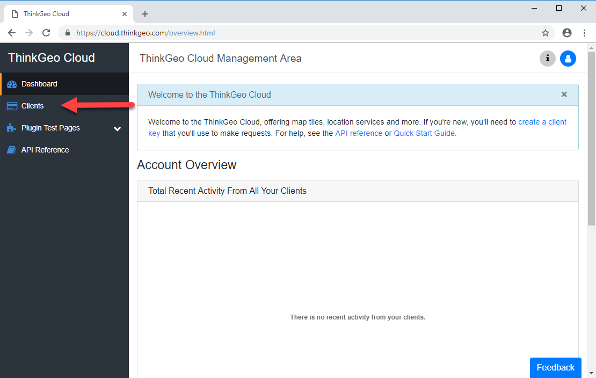
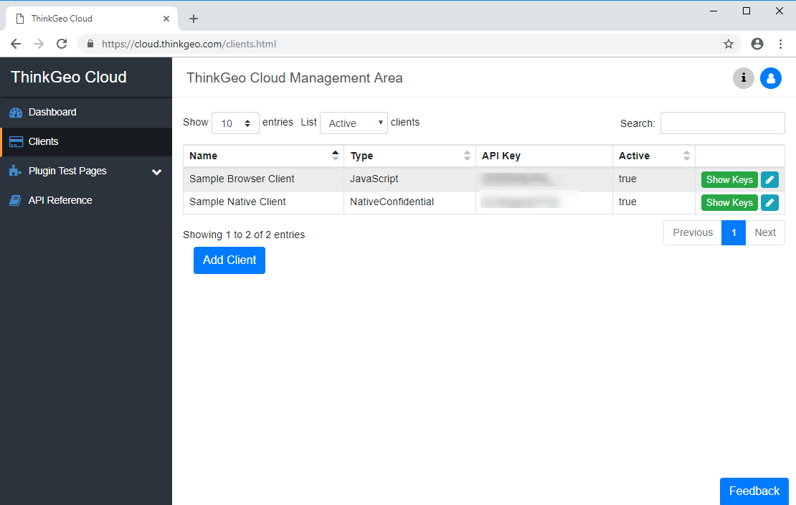
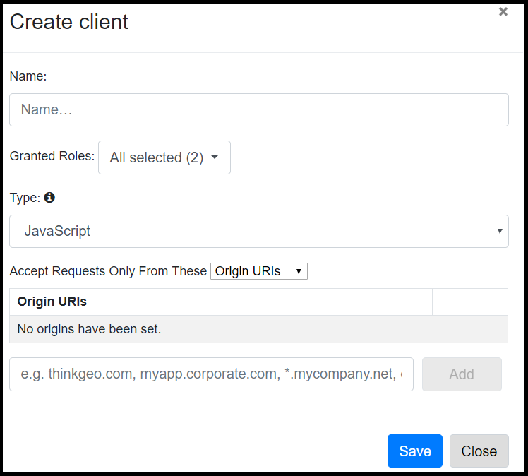
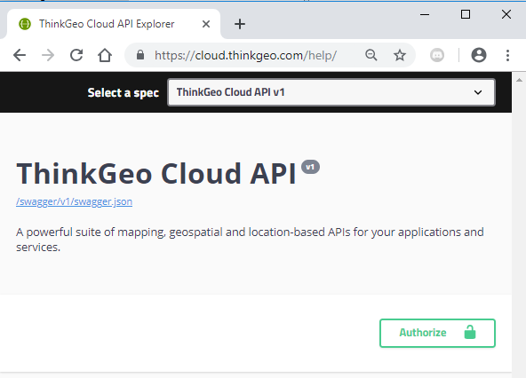

# Client Keys

A ThinkGeo Cloud Client Key is how you can enable your application or website to use ThinkGeo Cloud resources on your behalf.  You can have as many client keys in your account as you like. Different application or website can use different keys or share the same one.

## Use the Pre-Generated Test Keys

Two test clients have been pre-generated for a new ThinkGeo Account. Here is how to get them:

First, Log in to the ThinkGeo Cloud with your ThinkGeo account, the same one you can use to access our [community forums](http://community.thinkgeo.com/).  If you don't have a ThinkGeo account yet, [sign up for one here](https://singlepoint.thinkgeo.com/registration).

Then, visit the [ThinkGeo Cloud login page](https://cloud.thinkgeo.com/login.html) at and click "Login with ThinkGeo Account" button.

Once logged in, click on the "Clients" button on the menu bar.

New ThinkGeo Cloud accounts come with two clients, one is NativeConfidential and the other is JavaScript, which you can use to quickly get started. Click on the green **Show Keys** button and the ClientId & Client Secret (for NativeConfidential Key) or JavaScript API Key (for JavaScript Client Key) will show up and ready to use. Hit the blue pencil button on the far right to modify it.

## NativeConfidential and JavasScript Client Keys

There are two different kinds of client keys you can apply for your application: NativeConfidential, which is intended to be used in natively compiled applications or web services; and JavaScript, which is intended to be used in web applications. Below is a comparison of the two.

|Type|Description|Capabilities|Access Key(s)|Security|Authentication|
|----|-----------|------------|--------------|--------|--------------|
| NavtiveConfidential | Used in natively compiled applications or web services where the secret can be kept confidential | full access - including those which manage clients and your user profile | Two Base64 encoded strings (ClientID and ClientSecret) | These clients are called “NativeConfidential” because their secret key must be kept confidential, and thus they are only suitable for use in natively compiled applications or web services where the secret can be kept confidential, out of the hands of users. If unauthorized users gain access to both of them, they can use your client in their own applications and the API usage will count against your ThinkGeo Cloud account | They will authenticate by exchanging their ID and secret key for an identity token. Then, they will use that token to make requests to the ThinkGeo Cloud APIs. |
| JavaScript | Used in web applications | Can only access ThinkGeo Cloud plugins like elevation or the reverse geocoder | One Base64 encoded string (APIKey) | A JavaScript client's ID does not need to be kept confidential since they are intended for use in browser-based applications where a secret cannot be kept secure. But you should restrict the client so that it can only be used from web domains you control. | You only need to include the client ID in the URL of the API you are requesting – no tokens are required |
|||||||

## Creating a New Client

Besides using the pre-generated 2 clients, you can create as many new clients as you want.

Click on "Add Client" button and here pops up the "Create Client" window as follows:

* **Name**: The name of this client, to be easily recognized.
* **Granted Roles**: The security roles which will be granted to this client. Each client you create is able to have up to the same security roles your account has. When clients are created, they default to having all of the roles your account has.
* **Type**: JavaScript or NativeConfidential
  * JavaScript clients can whitelist usage by Origin Domain (e.g. mywebsite.com) or IP Address/IP Range (e.g. 203.0.113.78).
  * NativeConfidential clients can use IP Address/IP Range restriction only.

Once created, you can also check out the Keys by clicking on the Show Keys button on the same line, or modify it by hitting the blue pencil button on the far right.

**More about Granted Roles:**

As an account holder, you typically have two roles assigned to your account: “User”, and either “Evaluator” or “Subscriber” depending on whether or not you’ve paid us.  These roles provide access to different APIs as follows:

* The “User” role offers access to get and update your account profile, check your transaction statistics, see the status of your restriction quota (free evaluators are limited to 10,000 hits per day), and log into the web console.
* The “Evaluator” and “Subscriber” offer access to the actual services themselves: vector and raster tiles, WMS, elevation, geocoding and reverse geocoding, and so on.

Each client you create is able to have up to the same security roles your account has.  So if you have “User” and “Evaluator”, all of your clients can have those roles too – but you can also set a client to have fewer permissions than you if you want to lock it down further.  For example, if you’re only going to use your client to consume our services, and you won’t be using it to get account or statistics information, you could remove “User” from the Granted Roles dropdown.

For the most part, customers will never have to mess with this.  When clients are created, they default to having all of the roles your account has.  The only thing you might realistically ever want to do is remove “User” for extra security, but it’s not a big deal if you don’t.

**More about Client Key White List:**

JavaScript clients can whitelist individual origin URIs (e.g. mywebsite.com) that are allowed to use the client. This is useful for web applications that are hosted on a particular domain, where no other web address should be allowed to use your client. You can enter:

* specific web domain, e.g. mywebsite.com
* Wildcards to represent all subdomains of a given domain, e.g. *.mywebsite.com
JavaScript and NativeConfidential clients can whitelist individual IP addresses or IP address ranges that are allowed to use the client. You can enter:
          * A specific IP address, e.g. 203.0.13.55
          *An IP range with wildcards, e.g. 203.0.113.*
          * CIDR notation, e.g. 203.0.113.0/24

## Explore ThinkGeo Cloud Maps REST APIs

You can explore all of the Cloud Maps APIs through

Authorize with your key and you can play with ThinkGeo Cloud Restful APIs online.

Log in to [ThinkGeo Cloud Test Page](https://cloud.thinkgeo.com/help/) and click on the green Authorize button.

Available Authorizations window shows up and you can then input either a NativeConfidential(Client ID and Client Secret combination) or a JavaScript Key, and click the "Authorize" button to finish authorization.

All the APIs on [ThinkGeo Cloud Test Page](https://cloud.thinkgeo.com/help/) will be available to run online now after hitting the "Try it out" below each API.

## Advanced Usages

To make it even more secure, you can even create your own Token server serving your clients. In this way, your application doesn't need to hold NativeConfidential Keys and talk to ThinkGeo Server, instead it just talk to your own server to get the token. It's your token server that holds NativeConfidential Keys (ClientId/ClientSecret) and get the tokens from ThinkGeo.
