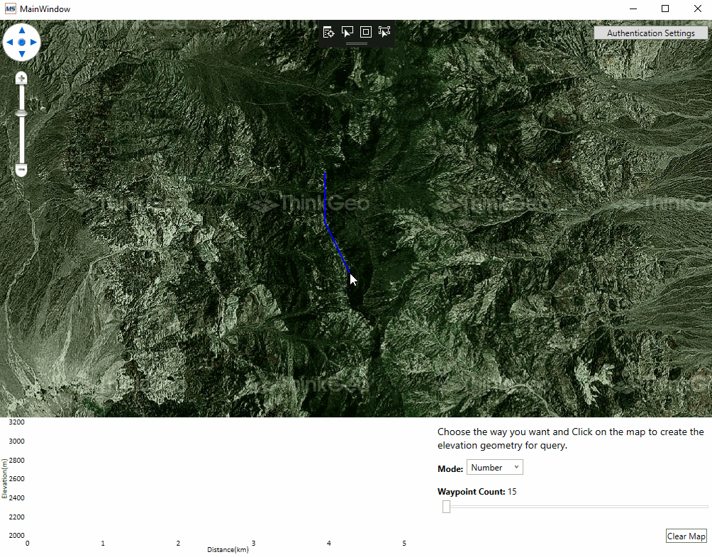
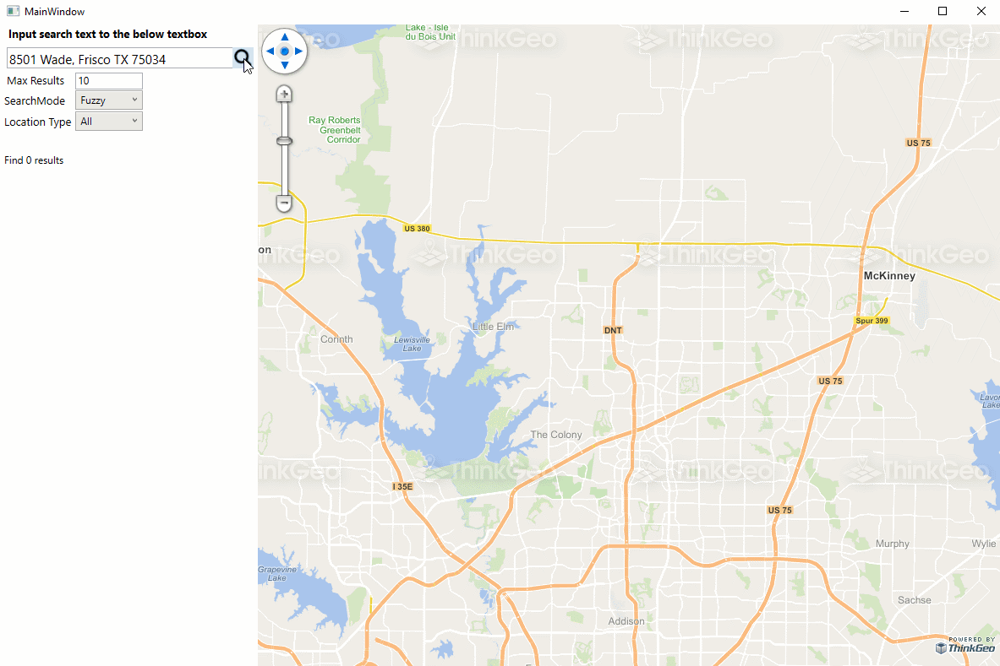
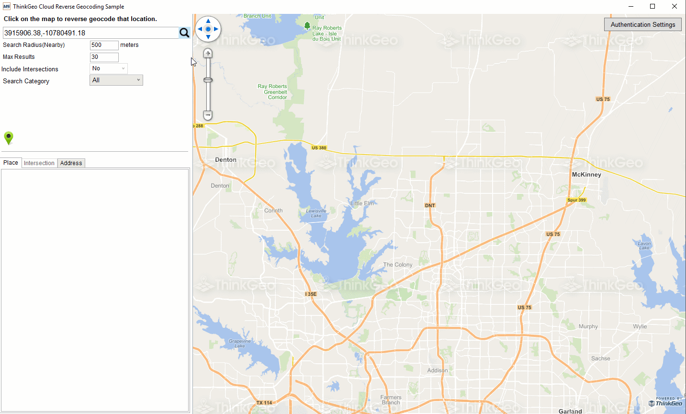
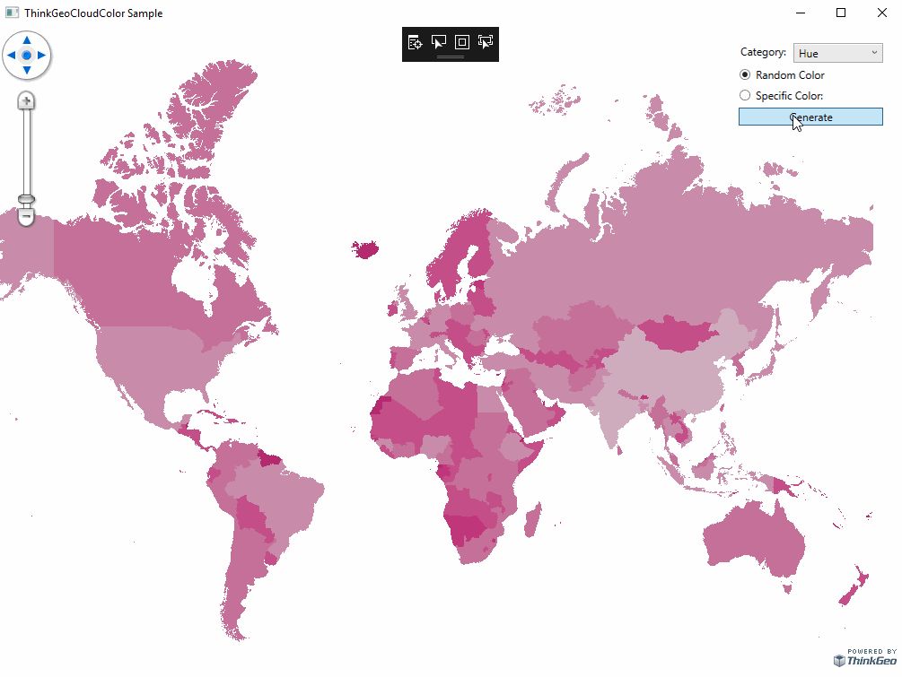

# .NET SDK

ThinkGeo Cloud .NET SDK helps developers use the ThinkGeo Cloud APIs in their .NET applications. You can use ThinkGeo Cloud APIs through standard RESTful API calls from any platform or any language and while you aren't required to use this SDK it will make the job easier when used in conjunction with ThinkGeo Cloud on a .NET project.

Check out this [Quick Start Guide](quickstart.md) to get started.

## APIs

ThinkGeo Cloud .NET SDK wraps all the [ThinkGeo Cloud RESTful APIs](https://cloud.thinkgeo.com/help/) and makes it simpler to use for a .NET project. Below are code snippets as samples:

### Raster and Vector Tile

```csharp
var client = new MapsCloudClient(clientId, clientSecret);
var imageStream = client.GetRasterTile(z, x, y, projection, mapType, tileSize, tileResolution);
var task = client.GetRasterTileAsync(z, x, y, projection, mapType, tileSize, tileResolution);
```

Not only do we have APIs to get one single Vector Tile or Raster Tile, but we also provide a much simpler way in ThinkGeo UI Components to render tiles on the map component. Below is an example for rending RasterTiles on a Desktop map (WPF):

```csharp
var backgroundMap = new ThinkGeoCloudMapsOverlay(clientId, clientSecret);
```

### Elevation

```csharp
var elevationClient = new ElevationCloudClient(clientId, clientSecret);
var response = elevationClient.GetElevationOfLineAsync(line, 3857, numberOfSegments: pointNumber, elevationUnit: DistanceUnit.Meter);
```

### Geocoding

```csharp
var geocodingClient = new GeocodingCloudClient(clientId, clientSecret);
var result = geocodingClient.SearchAsync(searchText, options);
```

### Reverse Geocoding

```csharp
var reverseGeocodingClient = new ReverseGeocodingCloudClient(clientId, clientSecret);
var searchResult = await reverseGeocodingClient.SearchPointAsync(searchPoint.X, searchPoint.Y, 3857, searchRadius, DistanceUnit.Meter, reverseGeocodingOption);
```

### Color

```csharp
var colorClient = new ColorCloudClient(clientId, clientSecret);
var hueColors = colorClient.GetColorsInHueFamily(specifiedColor, numberOfColors);
```

### Projection

```csharp
var projectionClient = new ProjectionCloudClient(clientId, clientSecret);
var projectedFeature = projectionClient.Project(feature, fromSrid, toSrid);
```

## Samples

The following samples work in all of the Map Suite controls such as WPF, Web, MVC, WebApi, Android and iOS.

### Elevation

This Sample demonstrates how you can use ThinkGeo Cloud to get elevation data from ThinkGeo's GIS Server and it also shows the elevation data of a road in the form of a line chart.

[](https://gitlab.com/thinkgeo/public/thinkgeo-cloud-maps/-/tree/master/samples/wpf/ThinkGeoCloudElevationSample)

### Geocoding

This Sample demonstrates how you can use ThinkGeo Cloud to convert a geographic location into meaningful addresses from ThinkGeo's GIS Server. It ships with an optimized set of worldwide coverage of cities and towns but any customized data can be supported as well.

[](https://gitlab.com/thinkgeo/public/thinkgeo-cloud-maps/-/tree/master/samples/wpf/ThinkGeoCloudGeocodingSample)

### Reverse Geocoding

This Sample demonstrates how you can use ThinkGeo Cloud to acquire an address from a set of location coordinates.  It ships with an optimized set of worldwide coverage of cities and towns but any customized data can be supported as well.

[](https://gitlab.com/thinkgeo/public/thinkgeo-cloud-maps/-/tree/master/samples/wpf/ThinkGeoCloudReverseGeocodingSample)

### Color Generator

This Sample demonstrates how you can use ThinkGeo Cloud to generate sets of related colors ideal for customizing map themes and enhancing other visual elements of your mapping projects.

[](https://gitlab.com/thinkgeo/public/thinkgeo-cloud-maps/-/tree/master/samples/wpf/ThinkGeoCloudColorSample)
