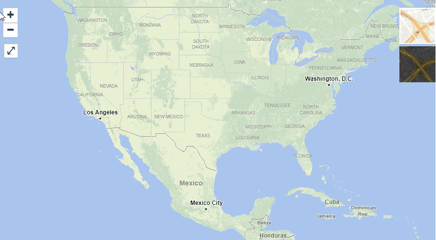
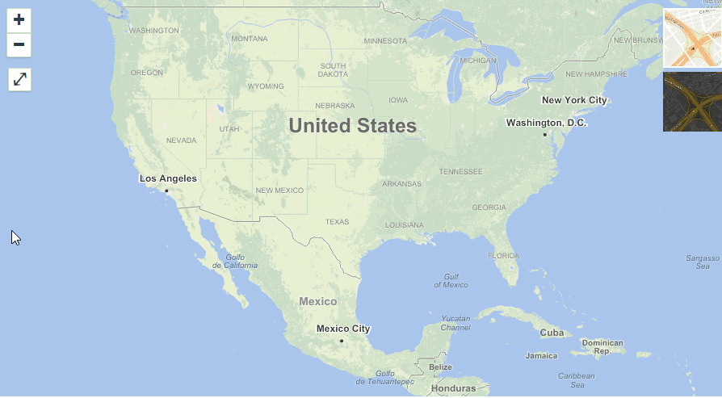
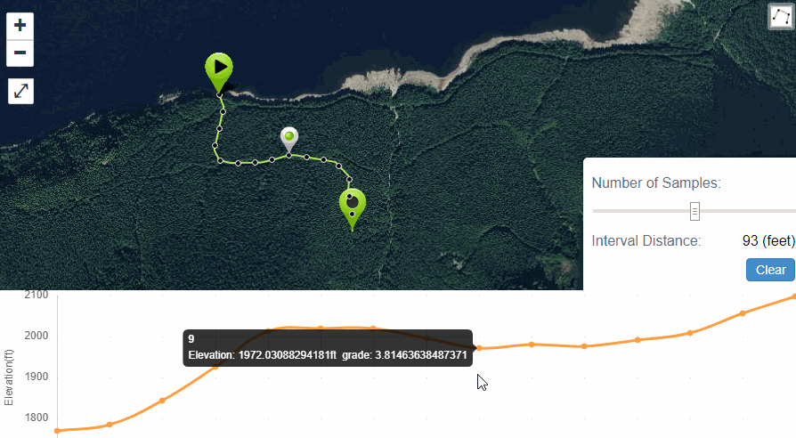
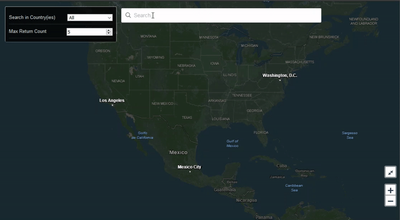
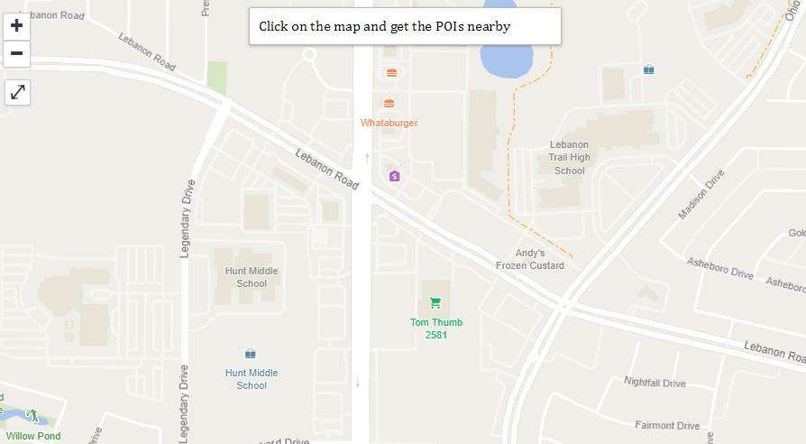
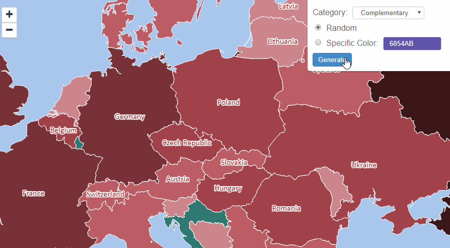
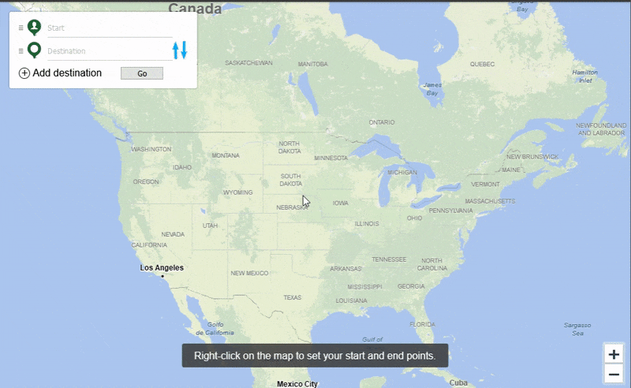
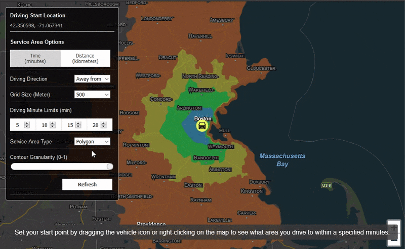
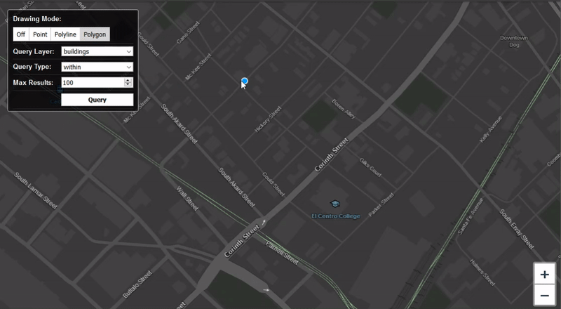

# JavaScript SDK

ThinkGeo Cloud .JavaScript SDK helps developers use the ThinkGeo Cloud APIs in their webpage. You can use ThinkGeo Cloud API through standard RESTful API calls from any platforms any language and don't have to use this SDK at all. It's just to make your job a bit easier when working with ThinkGeo Cloud on a webpage.

Check out [Quick Start Guide](quickstart.md) to get started.

## API Documentation

ThinkGeo Cloud JavaScript SDK wraps all the [ThinkGeo Cloud RESTful APIs](https://cloud.thinkgeo.com/help/) and make it simpler to use from a web page.

* `ThinkGeoCloudClient.js` - The ThinkGeoCloudClient-js API documentation covers the **tg** namespace which resides in the `ThinkGeoCloudCient.js`. It contains all of the ThinkGeo Cloud Client specific classes such as Elevation, ReverseGeocoding, Geocoding and more.

## ThinkGeo Cloud Client Samples

We have provided several online samples along with the source code to help you learn the different capabilities of ThinkGeo Cloud Client. For each sample, you can not only view the source but can also open in CodePen to change and run by yourself.

### Vector Tile Sample

Here is a sample shows how to consume ThinkGeo Cloud vector tiles using pre-defined Map Styles.

### Raster Tile Sample

Here is a sample shows how to consume ThinkGeo Cloud raster tiles via XYZ Map Service.

### Elevation Sample

Here is a sample shows how to launch an Elevation query with ThinkGeoCloudClient.js, and display the response.

### Geocoding Sample

Here is a sample shows how to launch a Geocoding query with ThinkGeoCloudClient.js, and display the response.

### Reverse Geocoding Sample

Here is a sample shows how to launch a ReverseGeocoding query with ThinkGeoCloudClient.js after clicking on the map, and display the response.

### Color Sample

Here is a sample shows how to launch a Color query with ThinkGeoCloudClient.js, and display the response.

### Routing Sample

Here is a sample shows how to launch a Routing query with ThinkGeoCloudClient.js, and display the response.

### Get Service Area Sample

Here is a sample shows how to launch a Get Service Area query with ThinkGeoCloudClient.js, and display the response.

### Maps Query Sample

Here is a sample shows how to launch a maps query with ThinkGeoCloudClient.js, and display the response.

